<h1> Tesseract-RoadSigns-Recognizer (Updated: 2022/05/26)</h1>

This is a simple example to recognize the strings in the images of RoadSigns by using Tesseract OCR Engine. 
We have created an <a href="./annotation/annotation.json">annotation.json</a>, and <a href="./TesseractRoadSignsRecognizer.py">
TesseractRoadSignsRecognizer</a> class and <a href="./CosineSimilarity.py">CosineSimilarity</a> class. Those are used to recognize the text 
in the RoadSigns images of <a href="https://github.com/sarah-antillia/PNG_USA_RoadSigns_160classes_V2">USA_RoadSigns_160classes</a>, which is a subset of 
<a href="https://en.wikipedia.org/wiki/Road_signs_in_the_United_States">Road signs in the United States</a>.
 
 
The annotation.json is a dictionary of class_id, classe_name and strings in the RoadSigns 160 classes as shown below: 
Except from annotation.json:
<pre>
{
"domain:": "us_roadsigns160",
"roadsigns": [
  {"class_id": 1,
    "class_name": "270_degree_loop","strings": []
  },
  {"class_id": 2,
    "class_name": "Added_lane","strings": []
  },
  {"class_id": 3,
    "class_name": "Added_lane_from_entering_roadway","strings": []
  },
  {"class_id": 4,
    "class_name": "All_way","strings": ["ALL", "WAY"]
  },
  {"class_id": 5,
    "class_name": "Be_prepared_to_stop","strings": ["BE", "PREPARED", "TO", "STOP"]
  },
  {"class_id": 6,
    "class_name": "Bicycle_wrong_way","strings": ["WRONG", "WAY"]
  },
  ...
</pre>
  
The CosineSimilarity computes the similarities between the every predefined string-list of RoadSigns in the annotation.json and a string-list recognized by ORC engine to a target image,
and select the best fitted class with the heighest similarity score for the target image.
 
On installation of Tesseract-OCR to Windows, please refer the following web site: 
<a href="https://github.com/UB-Mannheim/tesseract/wiki">Tesseract at UB Mannheim</a>
 
We use <a href="https://github.com/madmaze/pytesseract">Python Tesseract (pytesseract)</a> in <a href="./TesseractRoadSignsRecognizer.py">
TesseractRoadSignsRecognizer,py</a>. The pytesseract is a wrapper for <a href="https://github.com/tesseract-ocr/tesseract">Tesseract Open Source OCR Engine</a>. 
 
Please run the following command to recognize the strings in RoadSigns in <a href="./sample">sample</a> folder. 
<pre>
 python TesseractRoadSignsRecognizer.py ./sample  ./annotation/annotation.json ./sample_detection
</pre>

The images in <a href="./sample">sample</a> folder have been taken from <a href="https://github.com/sarah-antillia/PNG_USA_RoadSigns_160classes_V2">PNG_USA_RoadSigns_160classes_V2</a>
, and transformed by ImageWarpTrapezoider of <a href="https://github.com/sarah-antillia/ImageTransformer">ImageTransformer</a>.
  
<b>Recognition result: <a href="./sample_recognition">sample_recogntion</a></b> 
<table>
<tr>
<th >RecoginizedImage</th>
<th >FileName, StringList, Class, Similarity</th>
</tr>
<tr>
<td wrap>
1: All_way__medium_1000.png
 

</td>
<td wrap>
<a href='./sample_recognition/All_way__medium_1000.txt'>All_way__medium_1000.png,['ALL', 'WAY'],All_way,1.0</a>
</td>
</tr>
<tr>
<td wrap>
2: Be_prepared_to_stop__medium_1001.png
 
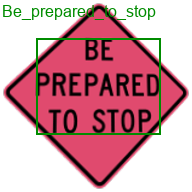
</td>
<td wrap>
<a href='./sample_recognition/Be_prepared_to_stop__medium_1001.txt'>Be_prepared_to_stop__medium_1001.png,['BE', 'PREPARED', 'JO', 'STOP,'],Be_prepared_to_stop,0.603</a>
</td>
</tr>
<tr>
<td wrap>
3: Bicycle_wrong_way__medium_1003.png
 
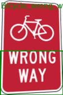
</td>
<td wrap>
<a href='./sample_recognition/Bicycle_wrong_way__medium_1003.txt'>Bicycle_wrong_way__medium_1003.png,['WRONG', 'WAY'],Bicycle_wrong_way,1.0</a>
</td>
</tr>
<tr>
<td wrap>
4: Bicycles_left_pedestrians_right__medium_1002.png
 
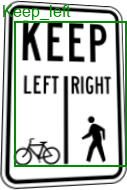
</td>
<td wrap>
<a href='./sample_recognition/Bicycles_left_pedestrians_right__medium_1002.txt'>Bicycles_left_pedestrians_right__medium_1002.png,['KEEP', 'R'],Keep_left,0.336</a>
</td>
</tr>
<tr>
<td wrap>
5: Bike_lane__medium_1004.png
 
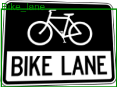
</td>
<td wrap>
<a href='./sample_recognition/Bike_lane__medium_1004.txt'>Bike_lane__medium_1004.png,['[BIKE', 'LANE'],Bus_lane,0.336</a>
</td>
</tr>
<tr>
<td wrap>
6: Bump__medium_1005.png
 

</td>
<td wrap>
<a href='./sample_recognition/Bump__medium_1005.txt'>Bump__medium_1005.png,[],,0</a>
</td>
</tr>
<tr>
<td wrap>
7: Bus_lane__medium_1006.png
 
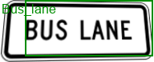
</td>
<td wrap>
<a href='./sample_recognition/Bus_lane__medium_1006.txt'>Bus_lane__medium_1006.png,['BUS', 'LANE'],Bus_lane,1.0</a>
</td>
</tr>
<tr>
<td wrap>
8: Center_lane__medium_1007.png
 
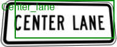
</td>
<td wrap>
<a href='./sample_recognition/Center_lane__medium_1007.txt'>Center_lane__medium_1007.png,['CENTER', 'LANE]'],Center_lane,1.0</a>
</td>
</tr>
<tr>
<td wrap>
9: Dead_end__medium_1008.png
 

</td>
<td wrap>
<a href='./sample_recognition/Dead_end__medium_1008.txt'>Dead_end__medium_1008.png,['DEAD', 'END'],Dead_end,1.0</a>
</td>
</tr>
<tr>
<td wrap>
10: Detour__medium_1010.png
 

</td>
<td wrap>
<a href='./sample_recognition/Detour__medium_1010.txt'>Detour__medium_1010.png,[],,0</a>
</td>
</tr>
<tr>
<td wrap>
11: Detour_right__medium_1009.png
 

</td>
<td wrap>
<a href='./sample_recognition/Detour_right__medium_1009.txt'>Detour_right__medium_1009.png,[],,0</a>
</td>
</tr>
<tr>
<td wrap>
12: Dip__medium_1011.png
 

</td>
<td wrap>
<a href='./sample_recognition/Dip__medium_1011.txt'>Dip__medium_1011.png,[],,0</a>
</td>
</tr>
<tr>
<td wrap>
13: Do_not_enter__medium_1012.png
 

</td>
<td wrap>
<a href='./sample_recognition/Do_not_enter__medium_1012.txt'>Do_not_enter__medium_1012.png,['DO', 'NOT', 'ENTER'],Do_not_enter,1.0</a>
</td>
</tr>
<tr>
<td wrap>
14: Do_not_pass_stopped_trains__medium_1013.png
 
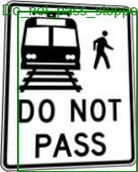
</td>
<td wrap>
<a href='./sample_recognition/Do_not_pass_stopped_trains__medium_1013.txt'>Do_not_pass_stopped_trains__medium_1013.png,['DO', 'NOT]', 'PASS', '_J'],Do_not_pass_stopped_trains,0.777</a>
</td>
</tr>
<tr>
<td wrap>
15: Emergency_signal__medium_1014.png
 

</td>
<td wrap>
<a href='./sample_recognition/Emergency_signal__medium_1014.txt'>Emergency_signal__medium_1014.png,['EMERGENCY', 'SIGNAL'],Emergency_signal,1.0</a>
</td>
</tr>
<tr>
<td wrap>
16: End_detour__medium_1015.png
 

</td>
<td wrap>
<a href='./sample_recognition/End_detour__medium_1015.txt'>End_detour__medium_1015.png,['END', 'DETOUR'],End_detour,1.0</a>
</td>
</tr>
<tr>
<td wrap>
17: Except_right_turn__medium_1016.png
 
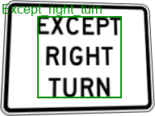
</td>
<td wrap>
<a href='./sample_recognition/Except_right_turn__medium_1016.txt'>Except_right_turn__medium_1016.png,['EXCEPT', 'RIGHT', 'TURN'],Except_right_turn,1.0</a>
</td>
</tr>
<tr>
<td wrap>
18: Fallen_rocks__medium_1017.png
 

</td>
<td wrap>
<a href='./sample_recognition/Fallen_rocks__medium_1017.txt'>Fallen_rocks__medium_1017.png,[],,0</a>
</td>
</tr>
<tr>
<td wrap>
19: Fog_area__medium_1018.png
 

</td>
<td wrap>
<a href='./sample_recognition/Fog_area__medium_1018.txt'>Fog_area__medium_1018.png,['FOG', 'AREA'],Fog_area,1.0</a>
</td>
</tr>
<tr>
<td wrap>
20: Go_on_slow__medium_1019.png
 

</td>
<td wrap>
<a href='./sample_recognition/Go_on_slow__medium_1019.txt'>Go_on_slow__medium_1019.png,['GO', 'ON', 'SLOW'],Go_on_slow,1.0</a>
</td>
</tr>
<tr>
<td wrap>
21: Gusty_winds_area__medium_1020.png
 
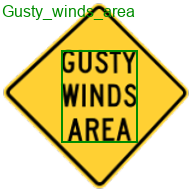
</td>
<td wrap>
<a href='./sample_recognition/Gusty_winds_area__medium_1020.txt'>Gusty_winds_area__medium_1020.png,['GUSTY', 'WINDS', 'AREA'],Gusty_winds_area,1.0</a>
</td>
</tr>
<tr>
<td wrap>
22: Hazardous_material_prohibited__medium_1021.png
 

</td>
<td wrap>
<a href='./sample_recognition/Hazardous_material_prohibited__medium_1021.txt'>Hazardous_material_prohibited__medium_1021.png,[],,0</a>
</td>
</tr>
<tr>
<td wrap>
23: Hazardous_material_route__medium_1022.png
 

</td>
<td wrap>
<a href='./sample_recognition/Hazardous_material_route__medium_1022.txt'>Hazardous_material_route__medium_1022.png,[],,0</a>
</td>
</tr>
<tr>
<td wrap>
24: Hidden_driveway__medium_1023.png
 
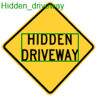
</td>
<td wrap>
<a href='./sample_recognition/Hidden_driveway__medium_1023.txt'>Hidden_driveway__medium_1023.png,['HIDDEN', 'DRIVEWAY,'],Hidden_driveway,1.0</a>
</td>
</tr>
<tr>
<td wrap>
25: Keep_left__medium_1025.png
 

</td>
<td wrap>
<a href='./sample_recognition/Keep_left__medium_1025.txt'>Keep_left__medium_1025.png,['KEEP', 'LEFT'],Keep_left,1.0</a>
</td>
</tr>
<tr>
<td wrap>
26: Keep_left_2__medium_1024.png
 
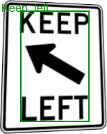
</td>
<td wrap>
<a href='./sample_recognition/Keep_left_2__medium_1024.txt'>Keep_left_2__medium_1024.png,['KEEP', 'X', 'LEFT'],Keep_left,0.709</a>
</td>
</tr>
<tr>
<td wrap>
27: Keep_right__medium_1027.png
 
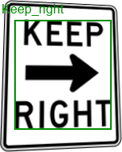
</td>
<td wrap>
<a href='./sample_recognition/Keep_right__medium_1027.txt'>Keep_right__medium_1027.png,['KEEP', 'RIGHT'],Keep_right,1.0</a>
</td>
</tr>
<tr>
<td wrap>
28: Keep_right_2__medium_1026.png
 
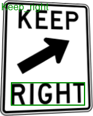
</td>
<td wrap>
<a href='./sample_recognition/Keep_right_2__medium_1026.txt'>Keep_right_2__medium_1026.png,['RIGHT'],Keep_right,0.58</a>
</td>
</tr>
<tr>
<td wrap>
29: Left_lane__medium_1028.png
 
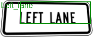
</td>
<td wrap>
<a href='./sample_recognition/Left_lane__medium_1028.txt'>Left_lane__medium_1028.png,['LEFT', 'LANE'],Left_lane,1.0</a>
</td>
</tr>
<tr>
<td wrap>
30: Left_turn_only__medium_1029.png
 

</td>
<td wrap>
<a href='./sample_recognition/Left_turn_only__medium_1029.txt'>Left_turn_only__medium_1029.png,[],,0</a>
</td>
</tr>
<tr>
<td wrap>
31: Left_turn_yield_on_green__medium_1030.png
 
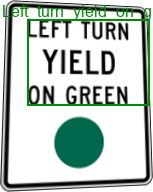
</td>
<td wrap>
<a href='./sample_recognition/Left_turn_yield_on_green__medium_1030.txt'>Left_turn_yield_on_green__medium_1030.png,['LEFT', 'TURN', 'YIELD', 'ON', 'GREEN'],Left_turn_yield_on_green,1.0</a>
</td>
</tr>
<tr>
<td wrap>
32: Loading_zone__medium_1031.png
 

</td>
<td wrap>
<a href='./sample_recognition/Loading_zone__medium_1031.txt'>Loading_zone__medium_1031.png,['LOADING', 'ZONE'],Loading_zone,1.0</a>
</td>
</tr>
<tr>
<td wrap>
33: Low_clearance__medium_1032.png
 

</td>
<td wrap>
<a href='./sample_recognition/Low_clearance__medium_1032.txt'>Low_clearance__medium_1032.png,[],,0</a>
</td>
</tr>
<tr>
<td wrap>
34: Metric_low_clearance__medium_1033.png
 

</td>
<td wrap>
<a href='./sample_recognition/Metric_low_clearance__medium_1033.txt'>Metric_low_clearance__medium_1033.png,[],,0</a>
</td>
</tr>
<tr>
<td wrap>
35: Minimum_speed_limit_40__medium_1034.png
 
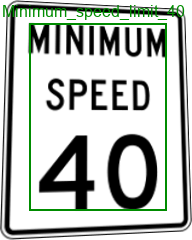
</td>
<td wrap>
<a href='./sample_recognition/Minimum_speed_limit_40__medium_1034.txt'>Minimum_speed_limit_40__medium_1034.png,['MINIMUM', 'SPEED', '40'],Minimum_speed_limit_40,1.0</a>
</td>
</tr>
<tr>
<td wrap>
36: Minimum_speed_limit_60km__medium_1035.png
 

</td>
<td wrap>
<a href='./sample_recognition/Minimum_speed_limit_60km__medium_1035.txt'>Minimum_speed_limit_60km__medium_1035.png,['MINIMUM', 'SPEED', 'UAL'],Minimum_speed_limit_40,0.503</a>
</td>
</tr>
<tr>
<td wrap>
37: Narrow_bridge__medium_1036.png
 
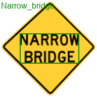
</td>
<td wrap>
<a href='./sample_recognition/Narrow_bridge__medium_1036.txt'>Narrow_bridge__medium_1036.png,['NARROW', 'BRIDGE'],Narrow_bridge,1.0</a>
</td>
</tr>
<tr>
<td wrap>
38: Night_speed_limit_45__medium_1037.png
 

</td>
<td wrap>
<a href='./sample_recognition/Night_speed_limit_45__medium_1037.txt'>Night_speed_limit_45__medium_1037.png,[],,0</a>
</td>
</tr>
<tr>
<td wrap>
39: Night_speed_limit_70km__medium_1038.png
 
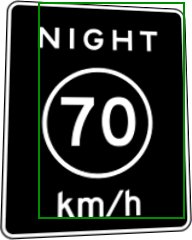
</td>
<td wrap>
<a href='./sample_recognition/Night_speed_limit_70km__medium_1038.txt'>Night_speed_limit_70km__medium_1038.png,['NE', 'HT', 'UAL'],,0</a>
</td>
</tr>
<tr>
<td wrap>
40: No_bicycles__medium_1039.png
 

</td>
<td wrap>
<a href='./sample_recognition/No_bicycles__medium_1039.txt'>No_bicycles__medium_1039.png,[],,0</a>
</td>
</tr>
<tr>
<td wrap>
41: No_entre__medium_1040.png
 

</td>
<td wrap>
<a href='./sample_recognition/No_entre__medium_1040.txt'>No_entre__medium_1040.png,[],,0</a>
</td>
</tr>
<tr>
<td wrap>
42: No_left_turn_across_tracks__medium_1041.png
 
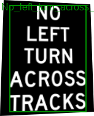
</td>
<td wrap>
<a href='./sample_recognition/No_left_turn_across_tracks__medium_1041.txt'>No_left_turn_across_tracks__medium_1041.png,['NO', 'LEFT', 'TURN', 'ACROSS', 'TRACKS'],No_left_turn_across_tracks,1.0</a>
</td>
</tr>
<tr>
<td wrap>
43: No_outlet__medium_1042.png
 

</td>
<td wrap>
<a href='./sample_recognition/No_outlet__medium_1042.txt'>No_outlet__medium_1042.png,[],,0</a>
</td>
</tr>
<tr>
<td wrap>
44: No_parking__medium_1050.png
 

</td>
<td wrap>
<a href='./sample_recognition/No_parking__medium_1050.txt'>No_parking__medium_1050.png,[],,0</a>
</td>
</tr>
<tr>
<td wrap>
45: No_parking_any_time__medium_1043.png
 
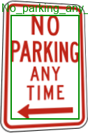
</td>
<td wrap>
<a href='./sample_recognition/No_parking_any_time__medium_1043.txt'>No_parking_any_time__medium_1043.png,['NO', 'PARKING', 'ANY', 'TIME'],No_parking_any_time,1.0</a>
</td>
</tr>
<tr>
<td wrap>
46: No_parking_bus_stop__medium_1044.png
 

</td>
<td wrap>
<a href='./sample_recognition/No_parking_bus_stop__medium_1044.txt'>No_parking_bus_stop__medium_1044.png,['NORE]', 'BUS', 'STOP'],No_parking_bus_stop,0.503</a>
</td>
</tr>
<tr>
<td wrap>
47: No_parking_from_830am_to_530pm__medium_1046.png
 

</td>
<td wrap>
<a href='./sample_recognition/No_parking_from_830am_to_530pm__medium_1046.txt'>No_parking_from_830am_to_530pm__medium_1046.png,['AM', 'T05:30PM'],No_parking_from_830am_to_530pm,0.11</a>
</td>
</tr>
<tr>
<td wrap>
48: No_parking_from_830am_to_530pm_2__medium_1045.png
 
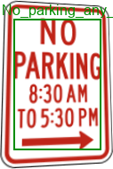
</td>
<td wrap>
<a href='./sample_recognition/No_parking_from_830am_to_530pm_2__medium_1045.txt'>No_parking_from_830am_to_530pm_2__medium_1045.png,['NO', 'PARKING', 'AM', '10', '5:30PM'],No_parking_any_time,0.261</a>
</td>
</tr>
<tr>
<td wrap>
49: No_parking_in_fire_lane__medium_1047.png
 
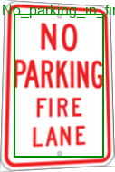
</td>
<td wrap>
<a href='./sample_recognition/No_parking_in_fire_lane__medium_1047.txt'>No_parking_in_fire_lane__medium_1047.png,['NO', 'PARKING', 'FIRE', 'LANE'],No_parking_in_fire_lane,0.777</a>
</td>
</tr>
<tr>
<td wrap>
50: No_parking_loading_zone__medium_1048.png
 

</td>
<td wrap>
<a href='./sample_recognition/No_parking_loading_zone__medium_1048.txt'>No_parking_loading_zone__medium_1048.png,['NO', 'PARKING||', 'LOADING', 'ZONE'],No_parking_loading_zone,1.0</a>
</td>
</tr>
<tr>
<td wrap>
51: No_parking_on_pavement__medium_1049.png
 
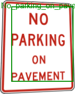
</td>
<td wrap>
<a href='./sample_recognition/No_parking_on_pavement__medium_1049.txt'>No_parking_on_pavement__medium_1049.png,['PARKING', 'ON', 'PAVEMENT'],No_parking_on_pavement,0.777</a>
</td>
</tr>
<tr>
<td wrap>
52: No_pedestrians__medium_1051.png
 
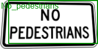
</td>
<td wrap>
<a href='./sample_recognition/No_pedestrians__medium_1051.txt'>No_pedestrians__medium_1051.png,['PEDESTRIANS'],No_pedestrians,0.58</a>
</td>
</tr>
<tr>
<td wrap>
53: No_standing_any_time__medium_1052.png
 

</td>
<td wrap>
<a href='./sample_recognition/No_standing_any_time__medium_1052.txt'>No_standing_any_time__medium_1052.png,['NO', 'STANDING', 'ANY', 'TIME'],No_standing_any_time,1.0</a>
</td>
</tr>
<tr>
<td wrap>
54: No_stopping_on_pavement__medium_1053.png
 
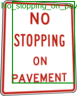
</td>
<td wrap>
<a href='./sample_recognition/No_stopping_on_pavement__medium_1053.txt'>No_stopping_on_pavement__medium_1053.png,['STOPPING', 'ON', 'PAVEMENT'],No_stopping_on_pavement,0.777</a>
</td>
</tr>
<tr>
<td wrap>
55: No_train_horn_warning__medium_1054.png
 
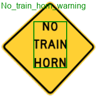
</td>
<td wrap>
<a href='./sample_recognition/No_train_horn_warning__medium_1054.txt'>No_train_horn_warning__medium_1054.png,['NO', 'TRAIN', 'HORN'],No_train_horn_warning,1.0</a>
</td>
</tr>
<tr>
<td wrap>
56: No_turns__medium_1055.png
 

</td>
<td wrap>
<a href='./sample_recognition/No_turns__medium_1055.txt'>No_turns__medium_1055.png,['NO', 'TURNS'],No_turns,1.0</a>
</td>
</tr>
<tr>
<td wrap>
57: No_unauthorized_vehicles__medium_1056.png
 
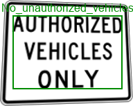
</td>
<td wrap>
<a href='./sample_recognition/No_unauthorized_vehicles__medium_1056.txt'>No_unauthorized_vehicles__medium_1056.png,['AUTHORIZED', 'VEHICLES', 'ONLY'],No_unauthorized_vehicles,1.0</a>
</td>
</tr>
<tr>
<td wrap>
58: One_way__medium_1057.png
 

</td>
<td wrap>
<a href='./sample_recognition/One_way__medium_1057.txt'>One_way__medium_1057.png,[],,0</a>
</td>
</tr>
<tr>
<td wrap>
59: Parking_with_time_restrictions__medium_1058.png
 
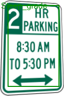
</td>
<td wrap>
<a href='./sample_recognition/Parking_with_time_restrictions__medium_1058.txt'>Parking_with_time_restrictions__medium_1058.png,['PARKING', '8:30AM', 'T0530', 'PM'],Steep_grade,0.335</a>
</td>
</tr>
<tr>
<td wrap>
60: Path_narrows__medium_1059.png
 
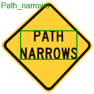
</td>
<td wrap>
<a href='./sample_recognition/Path_narrows__medium_1059.txt'>Path_narrows__medium_1059.png,['PATH', 'NARROWS'],Path_narrows,1.0</a>
</td>
</tr>
<tr>
<td wrap>
61: Railroad_crossing__medium_1060.png
 
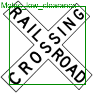
</td>
<td wrap>
<a href='./sample_recognition/Railroad_crossing__medium_1060.txt'>Railroad_crossing__medium_1060.png,['RY', '3', 'OY', 'NG'],Metric_low_clearance,0.22</a>
</td>
</tr>
<tr>
<td wrap>
62: Ramp_narrows__medium_1061.png
 

</td>
<td wrap>
<a href='./sample_recognition/Ramp_narrows__medium_1061.txt'>Ramp_narrows__medium_1061.png,['RAMP', 'JARROW:'],Ramp_narrows,0.336</a>
</td>
</tr>
<tr>
<td wrap>
63: Reserved_parking_wheelchair__medium_1062.png
 

</td>
<td wrap>
<a href='./sample_recognition/Reserved_parking_wheelchair__medium_1062.txt'>Reserved_parking_wheelchair__medium_1062.png,['RESERVED!', 'PARKING', 'BI', '4'],Reserved_parking_wheelchair,0.58</a>
</td>
</tr>
<tr>
<td wrap>
64: Reverse_turn__medium_1063.png
 

</td>
<td wrap>
<a href='./sample_recognition/Reverse_turn__medium_1063.txt'>Reverse_turn__medium_1063.png,[],,0</a>
</td>
</tr>
<tr>
<td wrap>
65: Right_lane__medium_1064.png
 
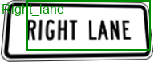
</td>
<td wrap>
<a href='./sample_recognition/Right_lane__medium_1064.txt'>Right_lane__medium_1064.png,['RIGHT', 'LANE'],Right_lane,1.0</a>
</td>
</tr>
<tr>
<td wrap>
66: Right_turn_only__medium_1065.png
 

</td>
<td wrap>
<a href='./sample_recognition/Right_turn_only__medium_1065.txt'>Right_turn_only__medium_1065.png,[],,0</a>
</td>
</tr>
<tr>
<td wrap>
67: Road_closed__medium_1067.png
 
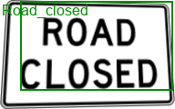
</td>
<td wrap>
<a href='./sample_recognition/Road_closed__medium_1067.txt'>Road_closed__medium_1067.png,['ROAD', 'CLOSED'],Road_closed,1.0</a>
</td>
</tr>
<tr>
<td wrap>
68: Road_closed_ahead__medium_1066.png
 
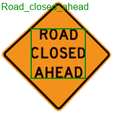
</td>
<td wrap>
<a href='./sample_recognition/Road_closed_ahead__medium_1066.txt'>Road_closed_ahead__medium_1066.png,['ROAD', 'CLOSED', 'AHEAD'],Road_closed_ahead,1.0</a>
</td>
</tr>
<tr>
<td wrap>
69: Road_narrows__medium_1068.png
 

</td>
<td wrap>
<a href='./sample_recognition/Road_narrows__medium_1068.txt'>Road_narrows__medium_1068.png,['ROAD', 'NARROWS'],Road_narrows,1.0</a>
</td>
</tr>
<tr>
<td wrap>
70: Rough_road__medium_1069.png
 
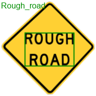
</td>
<td wrap>
<a href='./sample_recognition/Rough_road__medium_1069.txt'>Rough_road__medium_1069.png,['ROUGH', 'ROAD'],Rough_road,1.0</a>
</td>
</tr>
<tr>
<td wrap>
71: Runaway_vehicles_only__medium_1070.png
 
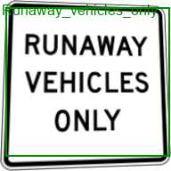
</td>
<td wrap>
<a href='./sample_recognition/Runaway_vehicles_only__medium_1070.txt'>Runaway_vehicles_only__medium_1070.png,['RUNAWAY', 'VEHICLES', 'ONLY'],Runaway_vehicles_only,1.0</a>
</td>
</tr>
<tr>
<td wrap>
72: School__medium_1073.png
 

</td>
<td wrap>
<a href='./sample_recognition/School__medium_1073.txt'>School__medium_1073.png,['(SCHOOL)'],School,1.0</a>
</td>
</tr>
<tr>
<td wrap>
73: School_bus_turn_ahead__medium_1071.png
 

</td>
<td wrap>
<a href='./sample_recognition/School_bus_turn_ahead__medium_1071.txt'>School_bus_turn_ahead__medium_1071.png,['SCHOOL', 'BUS', 'TURN', 'AHEAD'],School_bus_turn_ahead,1.0</a>
</td>
</tr>
<tr>
<td wrap>
74: School_speed_limit_ahead__medium_1072.png
 
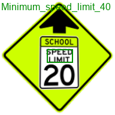
</td>
<td wrap>
<a href='./sample_recognition/School_speed_limit_ahead__medium_1072.txt'>School_speed_limit_ahead__medium_1072.png,['SPEED', 'UM'],Minimum_speed_limit_40,0.261</a>
</td>
</tr>
<tr>
<td wrap>
75: Speed_limit_50__medium_1074.png
 
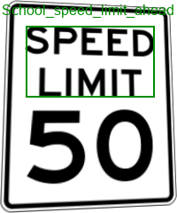
</td>
<td wrap>
<a href='./sample_recognition/Speed_limit_50__medium_1074.txt'>Speed_limit_50__medium_1074.png,['SPEED', 'LIMIT'],School_speed_limit_ahead,0.709</a>
</td>
</tr>
<tr>
<td wrap>
76: Speed_limit_80km__medium_1075.png
 
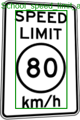
</td>
<td wrap>
<a href='./sample_recognition/Speed_limit_80km__medium_1075.txt'>Speed_limit_80km__medium_1075.png,['SPEED', 'LIMIT'],School_speed_limit_ahead,0.709</a>
</td>
</tr>
<tr>
<td wrap>
77: Stay_in_lane__medium_1076.png
 

</td>
<td wrap>
<a href='./sample_recognition/Stay_in_lane__medium_1076.txt'>Stay_in_lane__medium_1076.png,['STAY', 'IN|', 'LANE'],Stay_in_lane,1.0</a>
</td>
</tr>
<tr>
<td wrap>
78: Stop__medium_1080.png
 

</td>
<td wrap>
<a href='./sample_recognition/Stop__medium_1080.txt'>Stop__medium_1080.png,[],,0</a>
</td>
</tr>
<tr>
<td wrap>
79: Stop_here_for_pedestrians__medium_1077.png
 
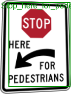
</td>
<td wrap>
<a href='./sample_recognition/Stop_here_for_pedestrians__medium_1077.txt'>Stop_here_for_pedestrians__medium_1077.png,['HERE', 'FOR', 'PEDESTRIANS'],Stop_here_for_pedestrians,0.777</a>
</td>
</tr>
<tr>
<td wrap>
80: Stop_here_for_peds__medium_1078.png
 

</td>
<td wrap>
<a href='./sample_recognition/Stop_here_for_peds__medium_1078.txt'>Stop_here_for_peds__medium_1078.png,['HERE'],Stop_here_for_peds,0.58</a>
</td>
</tr>
<tr>
<td wrap>
81: Stop_here_when_flashing__medium_1079.png
 
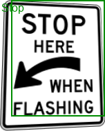
</td>
<td wrap>
<a href='./sample_recognition/Stop_here_when_flashing__medium_1079.txt'>Stop_here_when_flashing__medium_1079.png,['窶彜TOP', 'HERE', 'WHEN', 'FLASHING'],Stop,0.38</a>
</td>
</tr>
<tr>
<td wrap>
82: Straight_ahead_only__medium_1081.png
 

</td>
<td wrap>
<a href='./sample_recognition/Straight_ahead_only__medium_1081.txt'>Straight_ahead_only__medium_1081.png,[],,0</a>
</td>
</tr>
<tr>
<td wrap>
83: Truck_crossing__medium_1082.png
 
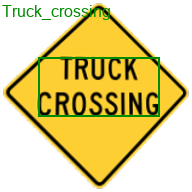
</td>
<td wrap>
<a href='./sample_recognition/Truck_crossing__medium_1082.txt'>Truck_crossing__medium_1082.png,['TRUCK', 'CROSSING'],Truck_crossing,1.0</a>
</td>
</tr>
<tr>
<td wrap>
84: Truck_route_sign__medium_1083.png
 
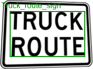
</td>
<td wrap>
<a href='./sample_recognition/Truck_route_sign__medium_1083.txt'>Truck_route_sign__medium_1083.png,['TRUCK', 'ROUTE'],Truck_route_sign,1.0</a>
</td>
</tr>
<tr>
<td wrap>
85: Truck_speed_limit_40__medium_1084.png
 

</td>
<td wrap>
<a href='./sample_recognition/Truck_speed_limit_40__medium_1084.txt'>Truck_speed_limit_40__medium_1084.png,['TRUCKS'],Truck_speed_limit_40,0.58</a>
</td>
</tr>
<tr>
<td wrap>
86: Turn_only_lanes__medium_1086.png
 
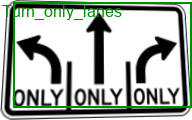
</td>
<td wrap>
<a href='./sample_recognition/Turn_only_lanes__medium_1086.txt'>Turn_only_lanes__medium_1086.png,['A.J', 'ONLY', '[ONLY', 'JONLY}'],Turn_only_lanes,0.747</a>
</td>
</tr>
<tr>
<td wrap>
87: Turning_vehicles_yield_to_pedestrians__medium_1085.png
 
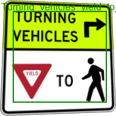
</td>
<td wrap>
<a href='./sample_recognition/Turning_vehicles_yield_to_pedestrians__medium_1085.txt'>Turning_vehicles_yield_to_pedestrians__medium_1085.png,['TURNING', 'VEHICLES', 'V', 'R'],Turning_vehicles_yield_to_pedestrians,0.411</a>
</td>
</tr>
<tr>
<td wrap>
88: Wait_on_stop__medium_1087.png
 

</td>
<td wrap>
<a href='./sample_recognition/Wait_on_stop__medium_1087.txt'>Wait_on_stop__medium_1087.png,['WAIT', 'ON', 'STOP'],Wait_on_stop,1.0</a>
</td>
</tr>
<tr>
<td wrap>
89: Weight_limit_10t__medium_1088.png
 
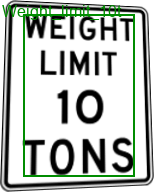
</td>
<td wrap>
<a href='./sample_recognition/Weight_limit_10t__medium_1088.txt'>Weight_limit_10t__medium_1088.png,['WEIGHT', 'LIMIT', '10', 'TONS'],Weight_limit_10t,1.0</a>
</td>
</tr>
<tr>
<td wrap>
90: Work_zone_for_speed_limit__medium_1089.png
 

</td>
<td wrap>
<a href='./sample_recognition/Work_zone_for_speed_limit__medium_1089.txt'>Work_zone_for_speed_limit__medium_1089.png,['WORK', 'ZONE'],Loading_zone,0.336</a>
</td>
</tr>
<tr>
<td wrap>
91: Wrong_way__medium_1090.png
 
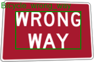
</td>
<td wrap>
<a href='./sample_recognition/Wrong_way__medium_1090.txt'>Wrong_way__medium_1090.png,['WRONG', 'WAY'],Bicycle_wrong_way,1.0</a>
</td>
</tr>
<tr>
<td wrap>
92: Y_roads__medium_1094.png
 
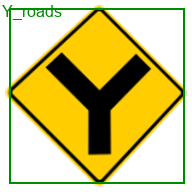
</td>
<td wrap>
<a href='./sample_recognition/Y_roads__medium_1094.txt'>Y_roads__medium_1094.png,['Y'],Y_roads,1.0</a>
</td>
</tr>
<tr>
<td wrap>
93: Yield__medium_1093.png
 

</td>
<td wrap>
<a href='./sample_recognition/Yield__medium_1093.txt'>Yield__medium_1093.png,[],,0</a>
</td>
</tr>
<tr>
<td wrap>
94: Yield_here_to_pedestrians__medium_1091.png
 
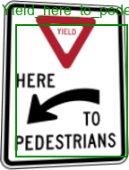
</td>
<td wrap>
<a href='./sample_recognition/Yield_here_to_pedestrians__medium_1091.txt'>Yield_here_to_pedestrians__medium_1091.png,['HERE', 'PEDESTRIANS'],Yield_here_to_pedestrians,0.709</a>
</td>
</tr>
<tr>
<td wrap>
95: Yield_here_to_peds__medium_1092.png
 
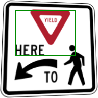
</td>
<td wrap>
<a href='./sample_recognition/Yield_here_to_peds__medium_1092.txt'>Yield_here_to_peds__medium_1092.png,['WV,'],,0</a>
</td>
</tr>
</table>
